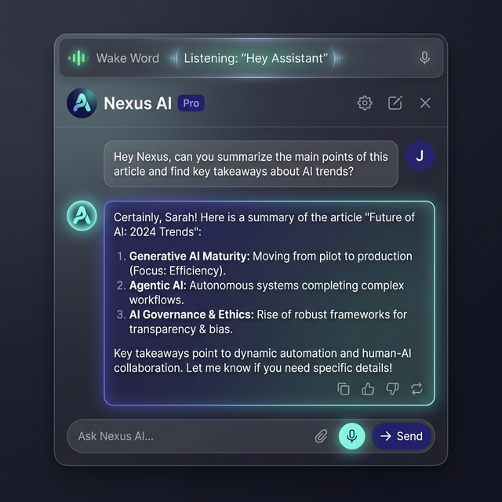

# AI Assistant - Chrome Extension

A powerful, multi-model AI assistant that lives in your browser as a sidebar and popup. Features voice interaction, document analysis, and custom-built dynamic buttons.

[View Changelog & Architectural Decisions](CHANGELOG.md)

## 🚀 Key Features

-   **Fluid Sidebar Integration**: Persistent, responsive sidebar using the modern `sidePanel` API.
-   **Multi-Model Support**: Seamlessly switch between Google Gemini, OpenAI GPT-4o, and Anthropic Claude 3.5/3.7 models.
-   **AI Architect (Dynamic Buttons)**: An intelligent action system that allows you to create custom, AI-powered automation buttons and menus.
-   **Voice Input & Wake Word**: Hands-free interaction. Just say **"Hey [AI Name]"** to wake up the chat and auto-send your voice commands.
-   **Knowledge Library**: Upload PDF and DOCX files to give the AI context-aware reasoning over your local documents.
-   **Secure Vault**: API keys are obfuscated locally using AES-256-GCM (Web Crypto API).
-   **Persistent History**: Full chat history management with save/recall/delete capabilities.
-   **Keyboard Shortcut**: Instantly open the extension with `Ctrl+Shift+Y` (or `Cmd+Shift+Y` on Mac).

## 🛠️ Built With

-   **Core**: Vanilla JavaScript, HTML5, CSS3.
-   **Chrome APIs**: Manifest V3, `chrome.sidePanel`, `chrome.scripting`, `chrome.storage`, `chrome.commands`.
-   **AI Infrastructure**: RESTful integration with OpenAI, Google Generative AI, and Anthropic APIs.
-   **Document Extraction**: `pdf.js` for PDF parsing and `mammoth.browser.js` for DOCX extraction.
-   **Security**: Professional-grade protection against XSS and RCE through strict CSP and sanitized DOM manipulation.

## 🔒 Security Hardening

This extension has undergone a rigorous security audit and features:
-   **No Unsafe Execution**: Zero use of `eval()` or `new Function()`.
-   **Total XSS Prevention**: Complete eradication of `innerHTML` in favor of safe DOM APIs.
-   **Sandbox Principles**: Strict Content Security Policy (CSP) enforcing `'self'` script execution.

## 📥 Installation

### Developer Mode (Recommended)
1.  Download or clone this repository.
2.  Open Chrome and navigate to `chrome://extensions`.
3.  Enable **"Developer mode"** in the top right.
4.  Click **"Load unpacked"** and select the extension directory.
5.  Use the shortcut `Ctrl+Shift+Y` to open your new sidebar!

## ⚙️ Configuration
1.  Open the extension settings via the ⚙️ icon.
2.  Choose your AI Provider and Model.
3.  Enter your API Key (stored with local obfuscation).
4.  Set your AI's name for the wake word feature (e.g., "Jarvis").
5.  **Save** and start chatting!

## 📄 License

This project is licensed under the **GNU General Public License v3.0** - see the [LICENSE](LICENSE) file for details.

## 🤝 Contributing

Contributions are welcome! Please feel free to submit a Pull Request. For major changes, please open an issue first to discuss what you would like to change.

---
*Created with a focus on Privacy, Security, and Architectural Excellence.*
